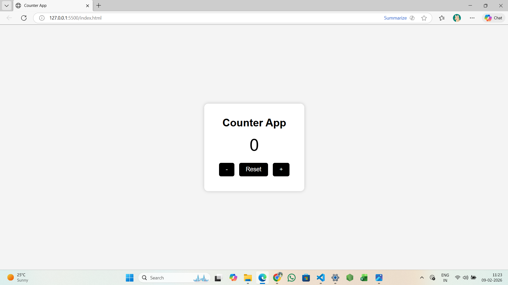

# Counter App (JavaScript)
A simple counter application built using HTML, CSS, and JavaScript.
## Features
- Increase counter
- Decrease counter
- Reset counter value
- Beginner-friendly UI
## Technologies Used
- HTML
- CSS
- JavaScript
## How to Run
Open `index.html` in any browser or use Live Server in VS Code.
## Screenshot

